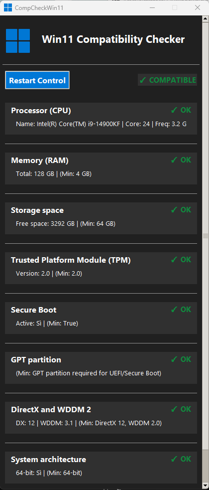

# Win11 Compatibility Checker

A desktop application that checks if your system meets the requirements for Windows 11.



## Features

- **Comprehensive System Check**: Analyzes all Windows 11 requirements:
  - CPU compatibility (generation and specifications)
  - RAM (minimum 4GB)
  - Storage space (minimum 64GB)
  - TPM 2.0 presence
  - Secure Boot capability
  - GPT partition format
  - DirectX 12 and WDDM 2.0
  - 64-bit architecture

- **User-Friendly Interface**:
  - Clear pass/fail indicators
  - Detailed system information display
  - Progress tracking during analysis
  - Dark mode interface

- **Detailed Recommendations**:
  - Specific advice for fixing compatibility issues
  - Links to official Microsoft resources
  - Step-by-step instructions for BIOS/UEFI settings

- **Export Functionality**:
  - Save results as JSON for troubleshooting or sharing

## Installation

### Option 1: Download the Executable
Download the latest release from the [Releases](https://github.com/yourusername/win11-compatibility-checker/releases) page.

### Option 2: Run from Source
1. Clone this repository:
```
git clone https://github.com/yourusername/win11-compatibility-checker.git
```

2. Install the required dependencies:
```
pip install pillow
```

3. Run the application:
```
python win11_checker.py
```

## Requirements

- Windows 7/8/10 operating system
- Python 3.6 or higher (if running from source)
- Administrator privileges (for some system checks)

## How It Works

The application uses various Windows system commands and registry queries to gather information about your hardware and system configuration. It then compares this information against Microsoft's official Windows 11 requirements.

No data is sent to external servers - all checks are performed locally on your machine.

## Contributing

Contributions are welcome! Please feel free to submit a Pull Request.

1. Fork the repository
2. Create your feature branch (`git checkout -b feature/amazing-feature`)
3. Commit your changes (`git commit -m 'Add some amazing feature'`)
4. Push to the branch (`git push origin feature/amazing-feature`)
5. Open a Pull Request

## License

This project is licensed under the MIT License - see the [LICENSE](LICENSE) file for details.

## Acknowledgments

- Microsoft for providing detailed Windows 11 system requirements
- The Python community for the tools that made this project possible

## Disclaimer

This tool is provided "as is" without warranty of any kind. The results should be used as a guide only. For official confirmation of Windows 11 compatibility, please use Microsoft's PC Health Check app.
